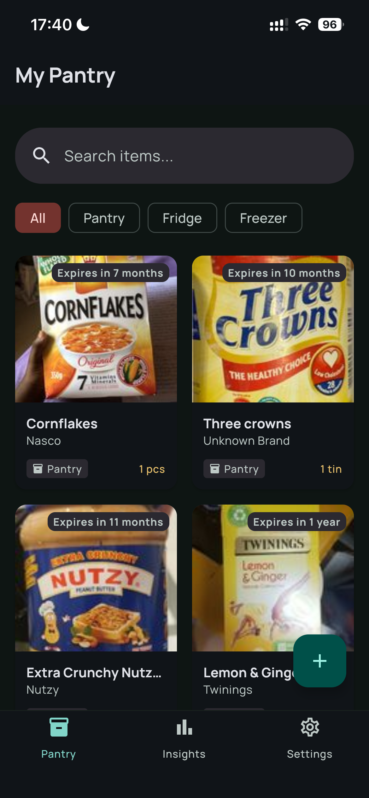
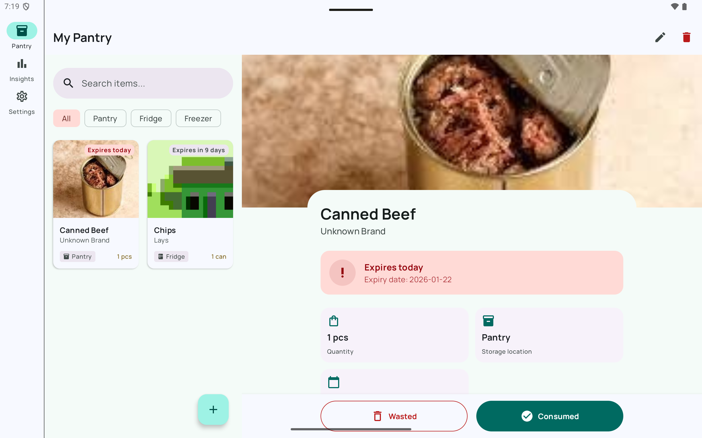
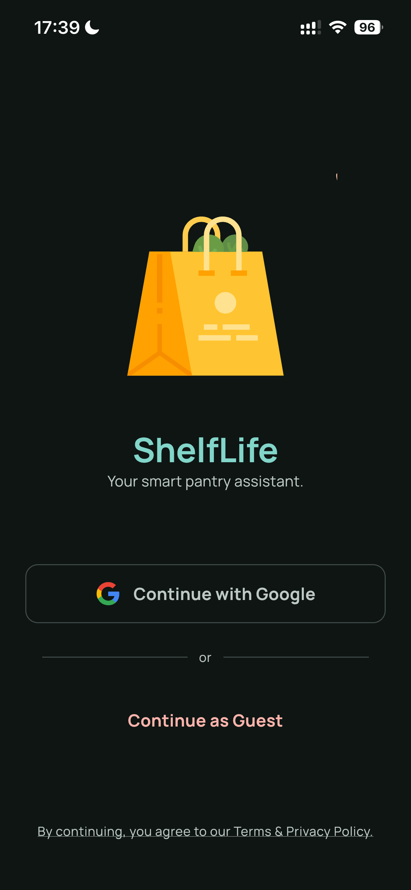
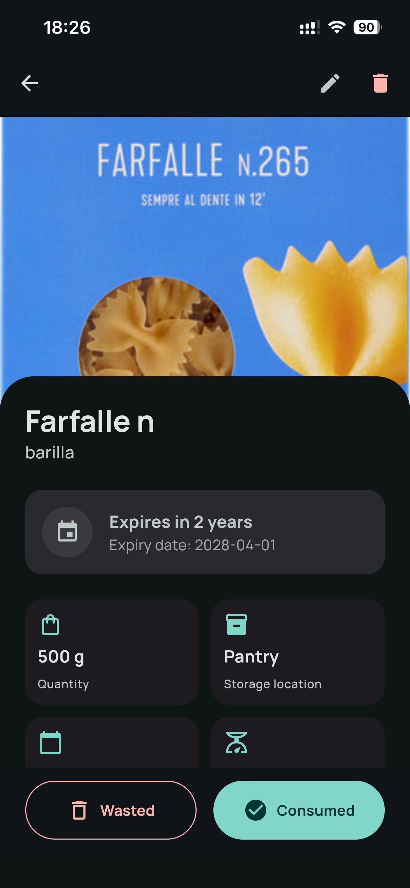
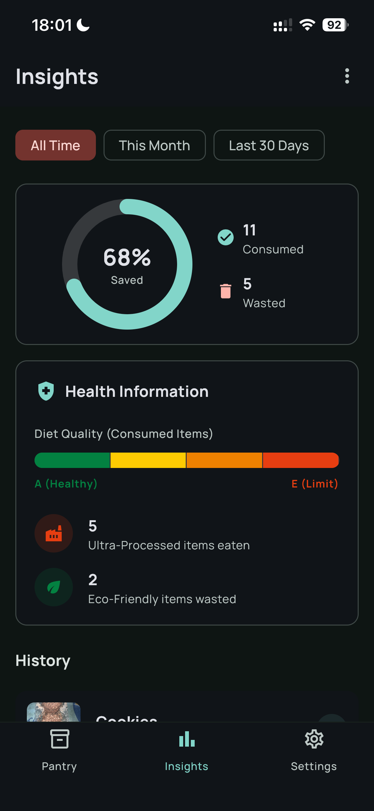
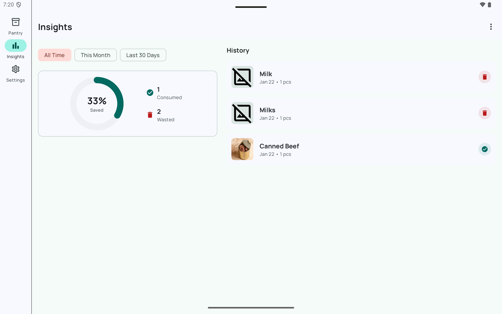
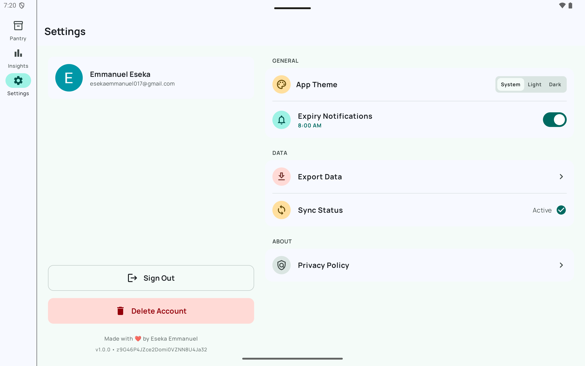

# ShelfLife 🍎

**ShelfLife** is a production-grade food inventory and expiry tracking application built with
*Kotlin Multiplatform (KMP)* and **Compose Multiplatform**.

It demonstrates a unified codebase running natively on **Android** and **iOS**, featuring
offline-first data synchronization, adaptive layouts for Tablets/Laptops, and platform-specific
hardware handling.

## 🎥 Demo Reel

See ShelfLife in action on both platforms.

|                                              **iOS (iPhone 13 Pro)**                                               |                                   **Android (Tablet Split-View)**                                   |
|:------------------------------------------------------------------------------------------------------------------:|:---------------------------------------------------------------------------------------------------:|
|  *(Click to watch)* |  *(Click to watch)* |

> *Note: On macOS (Apple Silicon), the Scanner feature is automatically disabled to prevent hardware
crashes, defaulting to a Gallery picker.*

## 📸 Screenshots

### Mobile Experience (iOS)

|                       Onboarding                       |                  Authentication                  |                   Pantry List                    |                    Item Detail                     |                       Insights                       |
|:------------------------------------------------------:|:------------------------------------------------:|:------------------------------------------------:|:--------------------------------------------------:|:----------------------------------------------------:|
|  |  |  |  |  |

### Adaptive Experience (Android Tablet & ChromeOS)

|              Split View (List + Detail)               |                   Dashboard & Insights                   |                         Settings                         |
|:-----------------------------------------------------:|:--------------------------------------------------------:|:--------------------------------------------------------:|
|  |  |  |

## 🚀 Key Features

* **Cross-Platform Architecture:** 100% Shared UI and Logic using Compose Multiplatform.
* **Adaptive UI:** Responsive layouts that switch between **Vertical** (Phones), **Split-View** (
  Tablets), and **Constrained Center** (macOS/Chromebooks).
* **Smart Inventory:** Track expiry dates, quantities, and storage locations.
* **Product Data Integration:** fetches nutritional data via the **OpenFoodFacts API**.
* **Hardware Aware:**
    * *Mobile:* Uses `KScan` for barcode scanning.
    * *macOS (Apple Silicon):* Detects desktop environment to safely disable unsupported camera
      hardware and fallback to file pickers.
* **Offline-First Sync:** Built with **Room Database** (Local) and **Firebase Firestore** (Remote).
  Works seamlessly without internet.
* **Insights Engine:** Visual analytics of consumption habits using Donut charts.

## 🛠 Tech Stack

* **Language:** Kotlin (KMP)
* **UI:** Compose Multiplatform (Material 3)
* **Architecture:** MVI (Model-View-Intent) + Clean Architecture
* **Dependency Injection:** Koin
* **Navigation:** JetBrains Navigation Compose
* **Local DB:** Room (SQLite)
* **Remote DB & Auth:** Firebase Firestore & Auth (Google Sign-In)
* **API:** OpenFoodFacts API (Ktor)
* **Hardware:** KScan (Barcode), CameraX / AVFoundation

## 🏗️ Building the Project

1. **Clone the repo:** `git clone https://github.com/eeseka/ShelfLife.git`
2. **Secrets:**
    * Add `google-services.json` to `composeApp/` (Android).
    * Add `GoogleService-Info.plist` to `iosApp/iosApp/` (iOS).
3. **Build:**
    * Android: Run via Android Studio (Supports Phones, Tablets, ChromeOS).
    * iOS: Open `iosApp.xcodeproj` in Xcode or run via Android Studio (Supports iPhone, iPad, Mac).